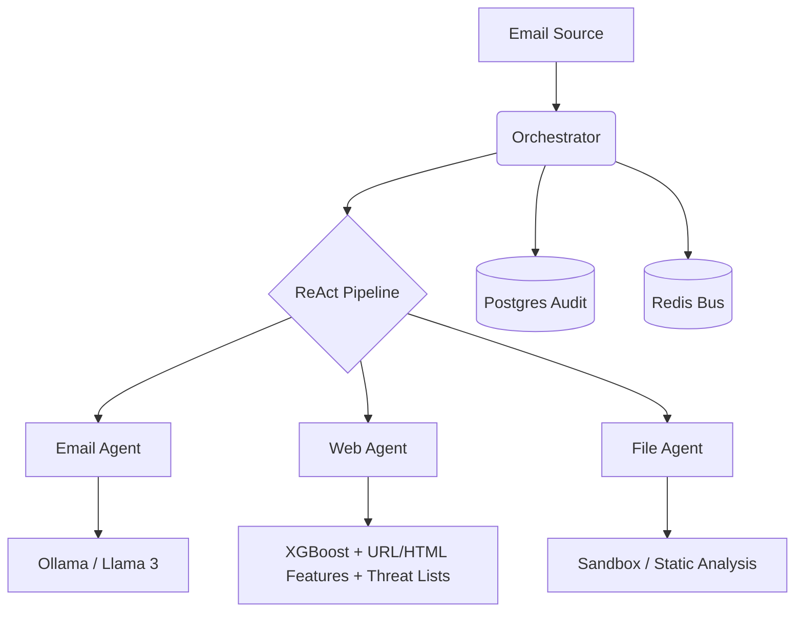

# SecureMail: Multi-Agent Email Security Pipeline

SecureMail is a production-ready, multi-agent system designed to analyze and mitigate email-based threats (phishing, malware, and social engineering) using a combination of traditional security protocols, machine learning (XGBoost), and Large Language Models (LLM).

The system follows a **ReAct (Reasoning and Acting)** pattern, where a central Orchestrator evaluates email metadata and content to dynamically delegate analysis to specialized agents.

---

## 🏗 Architecture Overview

SecureMail is built as a microservices architecture coordinated via a **Redis** message bus and a central **FastAPI Orchestrator**.



### Core Components

| Component | Responsibility | Tech Stack |
| :--- | :--- | :--- |
| **Orchestrator** | Pipeline management, Risk Scoring, Audit Logging | FastAPI, SQLAlchemy, Redis, PostgreSQL |
| **Email Agent** | SPF/DKIM/DMARC, Typosquatting, LLM Intent Analysis | Ollama (Llama 3), dkimpy |
| **Web Agent** | URL Phishing Detection (Threat Lists + URL/HTML Feature Scoring) | FastAPI, XGBoost, httpx, BeautifulSoup4 |
| **File Agent** | Attachment Analysis (Static & Dynamic) | ClamAV, YARA (planned) |

---

## 🚀 Getting Started

### Prerequisites

- **Docker & Docker Compose**
- **Python 3.11+** (for local development)
- **Ollama** (for local LLM inference)

### Installation

1. **Clone the repository:**
   ```bash
   git clone https://github.com/your-org/SecureMail.git
   cd SecureMail
   ```

2. **Setup Environment Variables:**
   Create a `.env` file in the root directory (refer to `.env.example` if available).

3. **Deploy with Docker Compose:**
   ```bash
   docker compose up -d --build
   ```
   This will start:
   - `orchestrator` (Port 8000)
   - `email-agent` (Port 8001)
   - `web-agent` (Port 8002)
   - `redis` (Port 6379)
   - `postgres` (Port 5432)
   - `ollama` (Local LLM service)

### Local Fast Test Workflow (WSL2-Friendly)

If testing feels manual, it is usually because reasoning is automated but service orchestration is still manual.
Use the helper script to make local testing one-command.

1. Start local services and wait for health:
   ```bash
   python3 scripts/devctl.py up
   ```

2. Check service status:
   ```bash
   python3 scripts/devctl.py status
   ```

3. Run test7 with deepdive (AI Agent path):
   ```bash
   python3 scripts/devctl.py test7 --llm
   ```
   Output file default:
   - `test7_scan_llm_ai_agent_output.json`

4. Stop services started by helper:
   ```bash
   python3 scripts/devctl.py down
   ```

WSL2 notes:
- Keep project under Linux filesystem (`/home/...`) for better IO performance.
- If frontend runs on Windows host and backend in WSL2, call API using WSL2 IP or configured CORS origins.
- Avoid relying on transient shell env vars for long sessions; prefer `.env` so restarts are deterministic.

---

## 🛠 Agent Details

### Email Agent
The first line of defense. It verifies the authenticity of the sender and uses an LLM to understand the "intent" of the email.
- **Protocol Check:** Validates SPF, DKIM, and DMARC records.
- **Typosquatting:** Detects look-alike domains (e.g., `bankofamer1ca.com`).
- **LLM Analysis:** Uses Llama 3 8B to classify email intent (Phishing, Scam, Safe) with high-confidence reasoning.

**Current implementation priority:** Implement `email_agent/config.py`, `guardrails.py`, and `typosquat_detector.py`.

### Web Agent
Analyzes all URLs found within the email body.
- **Fast-Path Classification:** Checks blacklist and whitelist first for immediate verdicts.
- **URL Context Resolution:** Follows redirects (bounded hops) and evaluates intermediate/final URLs.
- **Safe Fetch Guardrails:** Applies SSRF protections (public-IP-only resolution) before HTML fetch.
- **Feature Extraction + Inference:** Combines static URL features and parsed HTML features for XGBoost risk scoring.
- **Threat List Operations:** Supports startup loading, periodic background refresh, and manual refresh endpoints.

### Orchestrator & Pipeline
The brain of the system.
- **ReAct Logic:** "Think" -> "Act" -> "Observe" loop to determine if an email requires further deep-dive analysis.
- **Early Termination:** If protocol checks fail decisively (R_total > 0.95), it terminates early to save resources.
- **Audit Trace:** Every decision made by every agent is logged into PostgreSQL as a `reasoning_trace` for human review.

---

## 🛡 Security & Sovereignty

- **On-Premise LLM:** By using Ollama/Llama 3, email content never leaves your infrastructure, ensuring maximum data privacy.
- **Hardened Containers:** All agents run in isolated Docker containers with non-root users where possible.
- **Input Guardrails:** NeMo Guardrails are used to prevent prompt injection attacks against the Email Agent.

---

## 📖 API Documentation

Once the services are running, you can access the interactive Swagger UI:
- **Orchestrator:** `http://localhost:8000/docs`
- **Email Agent:** `http://localhost:8001/docs`
- **Web Agent:** `http://localhost:8002/docs`

### Example Scan Request
Use `curl.exe` on Windows PowerShell to avoid `Invoke-WebRequest` parsing errors:
```bash
curl.exe -X POST "http://localhost:8000/api/v1/scan" \
     -H "Content-Type: application/json" \
     -d '{
           "email_id": "test-001",
           "subject": "Urgent Action Required",
           "body": "Please login here: http://suspicious-link.com",
           "sender": "security@bank-verify.com"
         }'
```

---

## 📌 Operational Handoff

### Source-of-Truth Order
When docs and code conflict, trust this order:
1. `docker-compose.yml` (runtime ports, wiring, env contracts)
2. `orchestra/pipeline.py` and `orchestra/main.py` (actual orchestration behavior)
3. `orchestra/risk_scorer.py` and `orchestra/early_termination.py` (decision logic)
4. Agent `main.py` files (real exposed capability)
5. `README.md` (intent and overview)

### Current Implementation Snapshot

#### Implemented and usable
- **Orchestrator (`orchestra/`)**
   - FastAPI entrypoint and lifecycle setup.
   - ReAct-style flow: PERCEIVE → REASON → ACT → OBSERVE → REASON.
   - Conditional fan-out: always calls email agent, calls file/web only when needed.
   - Composite scoring and verdict generation.
- **Web Agent (`web_agent/`)**
   - URL analysis with model inference and threat-list checks.
   - Input validation via Pydantic schemas.
   - Health endpoint and analysis endpoints are implemented.
- **Infrastructure**
   - Compose stack includes orchestrator, email agent, file agent (stub), web agent, Redis, Postgres, Ollama, ClamAV.
- **Redis Bus (`orchestra/redis_bus.py`)**
   - Pub/sub and request-response utility is implemented and recently hardened.
   - Timeout handling uses bounded polling with a hard deadline.
   - Request-response path validates `request_id` matching (with legacy fallback when absent).
   - Subscribe path includes safer cleanup in `finally`.

#### Stubbed or incomplete
- **Email Agent (`email_agent/main.py`)** currently returns fixed/dummy analysis payloads.
- **File Agent (`stubs/file_agent_stub.py`)** is placeholder logic (fixed risk behavior).
- Empty modules:
   - `email_agent/guardrails.py`
   - `email_agent/typosquat_detector.py`
   - `email_agent/config.py`
- `email_agent/llm_analyzer.py` is not production-ready as-is and should be treated as unstable until refactored.

### Runtime and Interfaces
- Orchestrator external port is **8080** in compose.
- Internal service URLs are configured via env:
   - Email agent: `http://email-agent:8000`
   - File agent: `http://file-agent:8001`
   - Web agent: `http://web-agent:8002`
- Main endpoints:
   - Orchestrator: `POST /api/v1/scan`, `GET /health`
   - Agents: `POST /api/v1/analyze`, `GET /health`
- Redis bus channel prefixes:
   - `agent:email`, `agent:file`, `agent:web`, `orchestrator`

### Decision Logic
- Composite score uses weighted sum with redistribution when an agent is absent.
- Default thresholds:
   - `SAFE` if score < 0.4
   - `SUSPICIOUS` if 0.4 <= score < 0.7
   - `MALICIOUS` if score >= 0.7
- Early termination condition:
   - SPF + DKIM + DMARC all fail **and** email confidence > 0.95.

### Recommended Priorities
1. Replace `email_agent/main.py` stub path with real protocol + guardrails + LLM orchestration.
2. Implement `email_agent/config.py`, `guardrails.py`, `typosquat_detector.py`.
3. Replace `stubs/file_agent_stub.py` with a real file scanning service.
4. Add contract tests to freeze request/response schemas across services.
5. Add integration tests for happy path and degraded dependency modes.

### Quick Verification Checklist
- `docker compose config` passes.
- All `/health` endpoints return healthy.
- Orchestrator always invokes email; file/web remain conditional.
- Scoring thresholds and early-termination threshold match runtime settings.
- No production execution path depends on static stub payloads.
- Redis bus request-response calls time out deterministically and do not block indefinitely.
