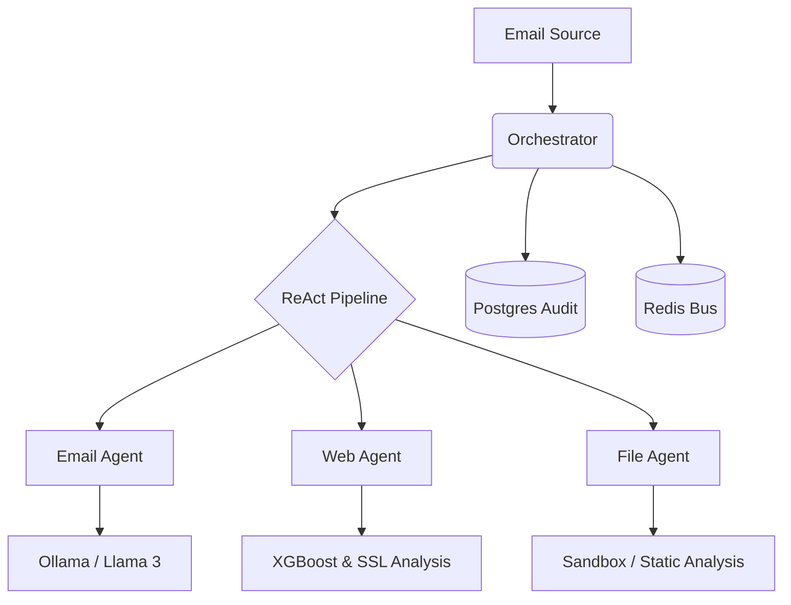

# SecureMail: Multi-Agent Email Security Pipeline

SecureMail is a production-ready, multi-agent system designed to analyze and mitigate email-based threats (phishing, malware, and social engineering) using a combination of traditional security protocols, machine learning (XGBoost), and Large Language Models (LLM).

The system follows a **ReAct (Reasoning and Acting)** pattern, where a central Orchestrator evaluates email metadata and content to dynamically delegate analysis to specialized agents.

---

## 🏗 Architecture Overview

SecureMail is built as a microservices architecture coordinated via a **Redis** message bus and a central **FastAPI Orchestrator**.



### Core Components

| Component | Responsibility | Tech Stack |
| :--- | :--- | :--- |
| **Orchestrator** | Pipeline management, Risk Scoring, Audit Logging | FastAPI, SQLAlchemy, Redis, PostgreSQL |
| **Email Agent** | SPF/DKIM/DMARC, Typosquatting, LLM Intent Analysis | Ollama (Llama 3), dkimpy |
| **Web Agent** | URL Phishing Detection, SSL/TLS Heuristics | XGBoost, stdlib `ssl`/`socket`, BeautifulSoup4 |
| **File Agent** | Attachment Analysis (Static & Dynamic) | ClamAV, YARA (planned) |

---

## 🚀 Getting Started

### Prerequisites

- **Docker & Docker Compose**
- **Python 3.11+** (for local development)
- **Ollama** (for local LLM inference)

### Installation

1. **Clone the repository:**
   ```bash
   git clone https://github.com/your-org/SecureMail.git
   cd SecureMail
   ```

2. **Setup Environment Variables:**
   Create a `.env` file in the root directory (refer to `.env.example` if available).

3. **Deploy with Docker Compose:**
   ```bash
   docker compose up -d --build
   ```
   This will start:
   - `orchestrator` (Port 8000)
   - `email-agent` (Port 8001)
   - `web-agent` (Port 8002)
   - `redis` (Port 6379)
   - `postgres` (Port 5432)
   - `ollama` (Local LLM service)

---

## 🛠 Agent Details

### Email Agent
The first line of defense. It verifies the authenticity of the sender and uses an LLM to understand the "intent" of the email.
- **Protocol Check:** Validates SPF, DKIM, and DMARC records.
- **Typosquatting:** Detects look-alike domains (e.g., `bankofamer1ca.com`).
- **LLM Analysis:** Uses Llama 3 8B to classify email intent (Phishing, Scam, Safe) with high-confidence reasoning.

### Web Agent
Analyzes all URLs found within the email body.
- **XGBoost Inference:** Uses a trained model (70 features) to predict URL maliciousness in <10ms.
- **SSL/TLS Analysis:** Performs real-time certificate inspection (Age, Issuer, SANs). Flags newly-issued certificates (<30 days) as HIGH risk.
- **Threat Lists:** Integrated async loading of remote and local blacklists/whitelists.
- **Signal Fusion:** Blends ML scores with SSL heuristics (e.g., HIGH-risk SSL adds +0.20 to the risk score).

### Orchestrator & Pipeline
The brain of the system.
- **ReAct Logic:** "Think" -> "Act" -> "Observe" loop to determine if an email requires further deep-dive analysis.
- **Early Termination:** If protocol checks fail decisively (R_total > 0.95), it terminates early to save resources.
- **Audit Trace:** Every decision made by every agent is logged into PostgreSQL as a `reasoning_trace` for human review.

---

## 🛡 Security & Sovereignty

- **On-Premise LLM:** By using Ollama/Llama 3, email content never leaves your infrastructure, ensuring maximum data privacy.
- **Hardened Containers:** All agents run in isolated Docker containers with non-root users where possible.
- **Input Guardrails:** NeMo Guardrails are used to prevent prompt injection attacks against the Email Agent.

---

## 📖 API Documentation

Once the services are running, you can access the interactive Swagger UI:
- **Orchestrator:** `http://localhost:8000/docs`
- **Email Agent:** `http://localhost:8001/docs`
- **Web Agent:** `http://localhost:8002/docs`

### Example Scan Request
Use `curl.exe` on Windows PowerShell to avoid `Invoke-WebRequest` parsing errors:
```bash
curl.exe -X POST "http://localhost:8000/api/v1/scan" \
     -H "Content-Type: application/json" \
     -d '{
           "email_id": "test-001",
           "subject": "Urgent Action Required",
           "body": "Please login here: http://suspicious-link.com",
           "sender": "security@bank-verify.com"
         }'
```
